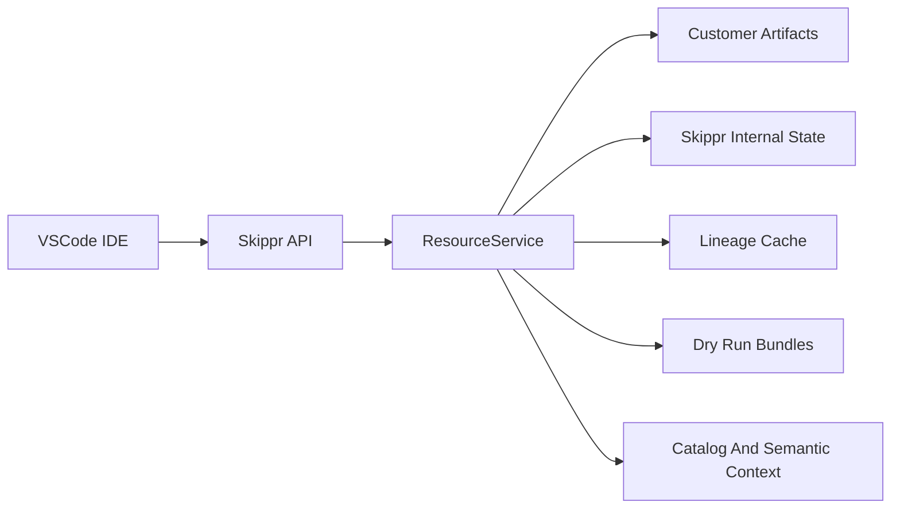

# Skippr Data IDE Master Plan

## Goal

Build a VSCode-based Skippr IDE that lets users inspect and operate existing Skippr data workflows first, then progressively adds first-class resources, lineage, dry-run diffs, review/edit/approval, atomic promotion, and governance.

The core product invariant:

> Users review and edit data-system changes as resources, with lineage/catalog/schema/stats context, before canonical state changes.

## References

Nao: https://getnao.io/
Cursor: 

## Delivery Sequence

1. [VSCode IDE PoC](./01_vscode_ide_poc.md)
2. [Resource API Over BAU Data](./02_resource_api_bau.md)
3. [Existing Workflows In IDE](./03_existing_workflows_ide.md)
4. [Materialized Lineage Cache](./04_materialized_lineage.md)
5. [Dry-Run Resources And Diffs](./05_dry_run_resources_diffs.md)
6. [Approval And Promotion](./06_approval_promotion.md)
7. [Governance And Catalog Editing](./07_governance_catalog_editing.md)

## Non-Goals For Initial Releases

- Do not expose `resource list/open/patch` as user-facing CLI commands.
- Do not add a DataFusion-backed local warehouse/provider in the initial plan.
- Do not make OpenLineage the internal canonical lineage format.
- Do not expose internal Skippr storage paths as public product contracts.

## Architecture Shape

## Data Boundaries

- Skippr-internal state: metadata caches, vectors, resource indexes, lineage cache, run/control state, review/promotion manifests.
- Customer-owned artifacts: dbt files, project config, semantic/catalog edits representing business intent, dry-run proposed edits before promotion.
- Operational customer state: offsets DB, WAL, runtime caches, temporary sync state.

Users should interact with resources and product APIs, not raw internal storage implementation.
